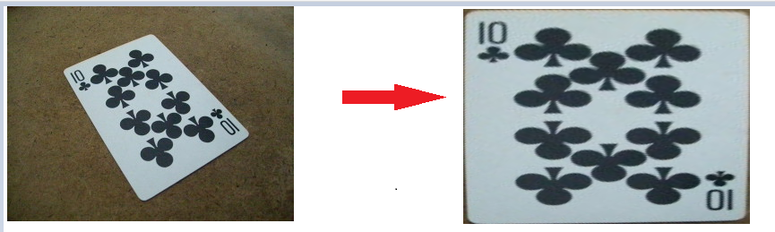

## getPerspectiveTransform
js实现opencv中的getPerspectiveTransform方法，计算仿射变换矩阵，参数是8个点，前四个是原始点，后四个是变换后的点，可以计算出4*4的矩阵，用于css的transform参数

```
<script src="./getPerspectiveTransform.js"></script>
<script>
  const op = [[-100, -49, 0, 1], [1, -91, 0, 1], [-12, 101, 0, 1], [117, 25, 0, 1]];
  const np = [[-160, -120, 0, 1], [160, -120, 0, 1], [-160, 120, 0, 1], [160, 120, 0, 1]]
  const m = getPerspectiveTransform(...op, ...np)
  document.querySelector('#image').style.transform = 'matrix3d(' + m.join(',') + ')';
</script>
```

